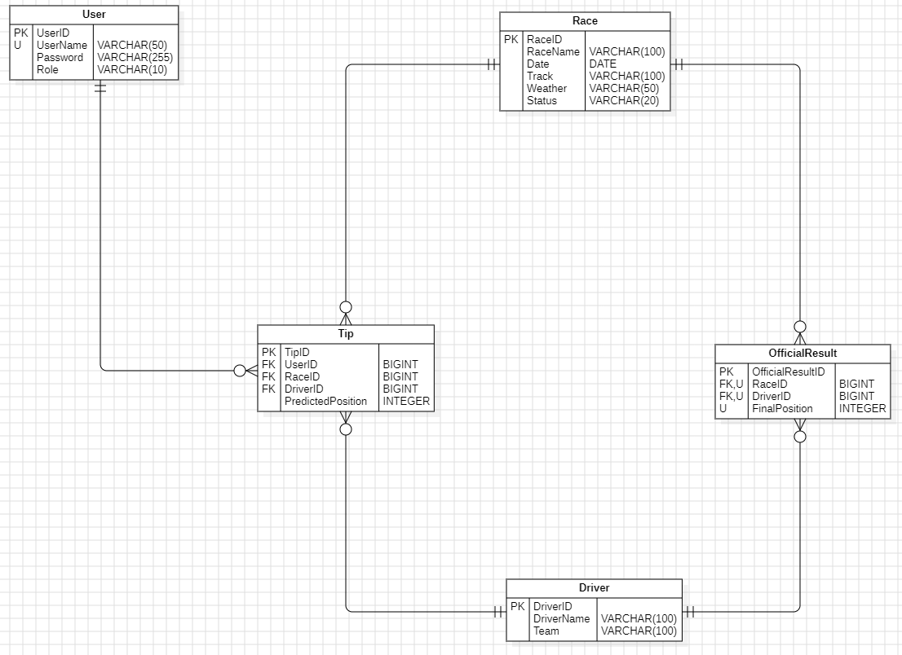

# 🏎️ F1 Championship – M223 Abschlussprojekt

> 📄 Diese README dient gleichzeitig als Projektdokumentation gemäss der Vorgabe vom Modul M223.

Dieses Projekt wurde im Rahmen des Moduls **M223 – Multi-User Anwendungen realisieren** erstellt.
Die F1 Championship ist eine vollständige Webanwendung, die es Benutzern ermöglicht, auf Formel-1-Rennen zu tippen und in einem Leaderboard gegeneinander anzutreten. Das System besteht aus einem Spring Boot Backend (REST-API) und einem React Frontend.

---

## 📚 Übersicht

Diese Anwendung ermöglicht:

- **Spieler (Players)**: Tipps auf Formel-1-Rennen abgeben, Leaderboard einsehen, Profil verwalten
- **Administratoren (Admins)**: Rennen erstellen und verwalten, Fahrer verwalten, offizielle Ergebnisse eintragen
- **Authentifizierung**: Sichere Anmeldung und Registrierung mit JWT-Tokens
- **Punkteberechnung**: Automatische Berechnung der Punkte basierend auf Tipp-Genauigkeit

---

## 📂 Projektstruktur

```
F1_Championship-main
├── Backend/          → Spring Boot REST-API (Java)
├── Frontend/         → React Webapp (JavaScript)
└── README.md         → Projektdokumentation
```

Das Projekt besteht aus zwei Hauptteilen:

- Einem **React-Frontend** zur Darstellung und Interaktion
- Einem **Spring Boot Backend** zur Datenverarbeitung über eine REST-API

---

## 🔧 Technologien

### Backend

- **Java 21**
- **Spring Boot 4.0.0**
- **Spring Security** (JWT-basierte Authentifizierung)
- **Spring Data JPA** (Datenbankzugriff)
- **PostgreSQL** (Datenbank)
- **Jakarta Validation** (Validierung)
- **JWT (jjwt)** (Token-Generierung)
- **Swagger/OpenAPI** (API-Dokumentation)

### Beschreibung:

Das Backend wurde mit Java und Spring Boot umgesetzt und stellt eine REST-API bereit. Die Anwendung ist klar in Controller-, Service- und Repository-Schichten aufgebaut.

Die Sicherheit erfolgt über Spring Security mit JWT-basierter Authentifizierung. Beim Login wird ein Token erzeugt, das bei jedem Request im Authorization-Header mitgesendet und serverseitig geprüft wird.

Passwörter werden mit BCrypt gehasht gespeichert. Die Datenpersistenz erfolgt über Spring Data JPA mit PostgreSQL als Datenbank.

### Frontend

- **React 19.2.0**
- **React Router DOM 7.10.0** (Routing)
- **Vite 7.2.4** (Build-Tool)
- **CSS3** (Styling)

### Beschreibung:

Das Frontend wurde mit React umgesetzt und bildet die Benutzeroberfläche der Anwendung. Die Navigation zwischen den Seiten erfolgt über React Router ohne Seitenreload.

Der Login-Status wird zentral über die React Context API verwaltet. Der AuthContext speichert den eingeloggten Benutzer und den JWT-Token, sodass alle Komponenten darauf zugreifen können.

Die Kommunikation mit dem Backend erfolgt über einen zentralen API-Service, der HTTP-Requests sendet und den JWT-Token automatisch im Authorization-Header mitsendet. Als Build-Tool wird Vite verwendet.

### Testing

- **JUnit 5** (Backend Unit-Tests)
- **Mockito** (Mocking)
- **MockMvc** (Controller-Tests)
- **Vitest** (Frontend Tests)
- **React Testing Library** (Komponenten-Tests)

### Beschreibung:

Für das Backend werden Unit- und Controller-Tests mit JUnit 5 umgesetzt. Mockito wird verwendet, um Abhängigkeiten zu mocken und Business-Logik isoliert zu testen. Mit MockMvc werden REST-Endpunkte getestet, ohne den Server vollständig zu starten.

Das Frontend wird mit Vitest getestet. Die React Testing Library prüft Komponentenverhalten aus Sicht des Benutzers, zum Beispiel Formulare, Interaktionen und die Anzeige von Daten.

---

## 👥 Nutzerrollen

### 🎮 Player (Spieler)

- Registrierung und Anmeldung
- Tipps auf offene Rennen abgeben
- Eigene Tipps ansehen und bearbeiten
- Leaderboard einsehen
- Profil verwalten (Display Name, Lieblings-Team, Land, Bio)

### 🔐 Admin (Administrator)

- Alle Player-Funktionen
- Rennen erstellen, bearbeiten und löschen
- Fahrer verwalten (CRUD-Operationen)
- Offizielle Rennergebnisse eintragen
- Rennen-Status verwalten (OPEN → VOTING → CLOSED)

---

## ✨ Features

### Authentifizierung & Autorisierung

- JWT-basierte Authentifizierung
- Rollenbasierte Zugriffskontrolle (ADMIN/PLAYER)
- Sichere Passwort-Speicherung (BCrypt)
- Token-basierte Session-Verwaltung

### Rennen-Verwaltung

- Rennen mit Status-System (OPEN, VOTING, CLOSED)
- Renndetails: Name, Datum, Strecke, Wetter, Reifen
- Ergebnisse-Order (Top 10 Fahrer)

### Tipp-System

- Tipps für Top 10 Positionen (1-10)
- Tipp-Validierung (nur bei Status VOTING)
- Tipp-Aktualisierung bis Voting geschlossen

### Punkteberechnung

- **Podium korrekt (Platz 1-3)**: 5 Punkte
- **Top 10 korrekt (Platz 4-10)**: 3 Punkte
- **Podium: Fahrer im Top 10, aber falsche Position**: 2 Punkte
- **Top 10: Fahrer im Top 10, aber falsche Position**: 1 Punkt

### Leaderboard

- Sortierung nach Gesamtpunkten
- Anzeige von Username, Display Name, Punkten und Rang

---

## 🧰 Voraussetzungen

- **JDK 21+**
- **Maven 3.8+**
- **PostgreSQL 14+**
- **Node.js 18+** und **npm**
- **Git**

---

## ▶️ Startanleitung

### 1. Datenbank einrichten

PostgreSQL-Datenbank anlegen:

```sql
CREATE DATABASE f1_championship_db;
```

### 2. Backend starten (Spring Boot)

Umgebungsvariablen setzen (Windows):

```cmd
set SPRING_DATASOURCE_URL=jdbc:postgresql://localhost:5432/f1_championship_db
set SPRING_DATASOURCE_USERNAME=dein_user
set SPRING_DATASOURCE_PASSWORD=dein_passwort
set JWT_SECRET=dein_sehr_langer_geheimer_schluessel_mindestens_32_zeichen
```

Oder in `application.properties` direkt eintragen (nicht empfohlen für Produktion).

Backend starten:

```cmd
cd Backend
./mvnw spring-boot:run
```

> **Backend läuft auf**: `http://localhost:8080`  
> **API-Dokumentation**: `http://localhost:8080/swagger-ui.html`

### 3. Frontend starten (React)

```cmd
cd Frontend
npm install
npm run dev
```

> **Frontend läuft auf**: `http://localhost:5173`  
> Stelle sicher, dass das Backend auf Port `8080` läuft.

---

## 🛠️ Datenbank-Konfiguration

Die Datenbank-Konfiguration erfolgt über Umgebungsvariablen in `application.properties`:

```properties
spring.datasource.url=${SPRING_DATASOURCE_URL}
spring.datasource.username=${SPRING_DATASOURCE_USERNAME}
spring.datasource.password=${SPRING_DATASOURCE_PASSWORD}
jwt.secret=${JWT_SECRET}
spring.jpa.hibernate.ddl-auto=update
spring.jpa.database-platform=org.hibernate.dialect.PostgreSQLDialect
```

---

## 📦 Datenmodell (ERD)



### Beziehungen:

- **AppUser** → **Tip** (1:N) - Ein User kann mehrere Tipps abgeben
- **Race** → **Tip** (1:N) - Ein Rennen kann mehrere Tipps haben
- **Race** → **OfficialResult** (1:N) - Ein Rennen hat mehrere offizielle Ergebnisse
- **Driver** → **Tip** (1:N) - Ein Fahrer kann in mehreren Tipps vorkommen
- **Driver** → **OfficialResult** (1:N) - Ein Fahrer kann in mehreren Ergebnissen vorkommen

---

## 🏗️ Backend-Architektur

### Layer-Architektur-Diagramm

```
┌─────────────────────────────────────────┐
│    CONTROLLER LAYER  (REST-Endpoints)   │
│  - AuthController                       │
│  - RaceController                       │
│  - TipController                        │
│  - LeaderboardController                │
│  - UserController                       │
└─────────────────────────────────────────┘
                  │
                  ↓
┌─────────────────────────────────────────┐
│    SERVICE LAYER     (Business-Logik)   │
│  - AppUserService                       │
│  - RaceService                          │
│  - TipService                           │
│  - LeaderboardService                   │
│  - JwtService                           │
└─────────────────────────────────────────┘
                  │
                  ↓
┌─────────────────────────────────────────┐
│    REPOSITORY LAYER (Datenbankzugriff)  │
│  - AppUserRepository                    │
│  - RaceRepository                       │
│  - TipRepository                        │
│  - DriverRepository                     │
└─────────────────────────────────────────┘
                  │
                  ↓
┌─────────────────────────────────────────┐
│         DATABASE           (Tabellen)   │
│         PostgreSQL                      │
│  - app_users                            │
│  - races                                │
│  - voting                               │
│  - drivers                              │
│  - official_results                     │
└─────────────────────────────────────────┘


```

### Projektstruktur

Das Backend ist nach Best Practices modular aufgebaut:

```

com.wiss.f1.championship
├── config/                 → Konfigurationsklassen (Security, Swagger, etc.)
│ ├── SecurityConfig.java
│ ├── OpenApiConfig.java
│ └── ...
│
├── controller/             → REST-Controller (API-Endpunkte)
│ ├── AuthController.java
│ ├── RaceController.java
│ └── ...
│
├── dto/                    → Data Transfer Objects für Requests/Responses
│ ├── AuthRequestDTO.java
│ ├── UserProfileDTO.java
│ └── ...
│
├── entity/                 → JPA-Entitäten (Datenbankmodell)
│ ├── AppUser.java
│ ├── Race.java
│ └── ...
│
├── exception/              → Zentrale Fehlerbehandlung
│ ├── GlobalExceptionHandler.java
│ ├── UserNotFoundException.java
│ └── ...
│
├── repository/             → JPA-Repositories (Datenbankzugriff)
│ ├── AppUserRepository.java
│ ├── RaceRepository.java
│ └── ...
│
├── security/               → JWT & Security-Logik
│ ├── JwtService.java
│ ├── JwtAuthenticationFilter.java
│ └── ...
│
└── service/                → Business-Logik
  ├── AppUserService.java
  ├── RaceService.java
  └── ...


```

### JWT-Auth-Flow-Diagramm

```

┌─────────────────────────────────────────┐
│              CLIENT                     │
│             (Frontend)                  │
└─────────────────────────────────────────┘
                  │
                  │ 1. POST /api/auth/login
                  │    { username, password }
                  ↓
┌─────────────────────────────────────────┐
│           AuthController                │
│  - Validiert Credentials                │
│  - Ruft AppUserService auf              │
└─────────────────────────────────────────┘
                  │
                  ↓
┌─────────────────────────────────────────┐
│           AppUserService                │
│  - Prüft User in der Datenbank          │
│  - Vergleicht Passwort (BCrypt)         │
└─────────────────────────────────────────┘
                  │
                  ↓
┌─────────────────────────────────────────┐
│             JwtService                  │
│  - Generiert JWT-Token                  │
│  - Enthält: userId, username, role, exp │
└─────────────────────────────────────────┘
                  │
                  │ 2. Response: { token, user }
                  ↓
┌─────────────────────────────────────────┐
│              CLIENT                     │
│  - Speichert JWT-Token                  │
└─────────────────────────────────────────┘
                  │
                  │ 3. GET /api/races
                  │    Authorization: Bearer <token>
                  ↓
┌─────────────────────────────────────────┐
│      JwtAuthenticationFilter            │
│  - Extrahiert JWT aus Header            │
│  - Validiert Token                      │
│  - Lädt User aus Token                  │
│  - Setzt Authentication im              │
│    SecurityContext                      │
└─────────────────────────────────────────┘
                  │
                  ↓
┌─────────────────────────────────────────┐
│            RaceController               │
│  - Greift auf Authentication zu         │
│  - Ruft RaceService auf                 │
└─────────────────────────────────────────┘


```

---

## 🎨 Frontend-Architektur

### Komponentenübersicht

```

Frontend/src/
├── main.jsx              → Einstiegspunkt
├── App.jsx               → Haupt-App-Komponente
│
├── contexts/             → Globales State-Management
│ ├── AuthContext.js
│ ├── AuthProvider.jsx
│ └── ...
│
├── router/               → Routing-Definitionen
│ └── AppRouter.jsx → Route-Definitionen
│
├── components/           → Wiederverwendbare UI-Komponenten
│ ├── layout/
│ │ ├── Layout.jsx
│ │ ├── Navbar.jsx
│ │ └── ...
│ │
│ └── common/
│   ├── ErrorBoundary.jsx
│   └── ...
│
├── pages/                → Seiten der Anwendung
│ ├── HomePage.jsx → Startseite
│ ├── PageNotFound.css
│ ├── PageNotFound.jsx
│ │
│ ├── auth/
│ │ ├── LoginPage.jsx
│ │ └── RegisterPage.jsx
│ │
│ ├── player/
│ │ ├── PlayerDashboardPage.jsx
│ │ ├── PlayerRaceListPage.jsx
│ │ └── ...
│ │
│ └── admin/
│ ├── AdminDashboardPage.jsx
│ ├── AdminRaceListPage.jsx
│ └── ...
│
├── services/             → API-Service-Layer
│ ├── api.js
│ ├── driverService.js
│ └── ...
│
└── utils/                → Hilfsfunktionen
  ├── tokenStorage.js
  ├── errorHandler.js
  └── ...

```

### State-Management-Flow (AuthContext)

Das Frontend nutzt React Context API für zentrales State-Management der Authentifizierung. Dies ermöglicht es, den User-Status in der gesamten Anwendung zu teilen, ohne Props durch viele Komponenten zu reichen.

```

┌─────────────────────────────────────────┐
│             AuthProvider                │
│   (Wird in main.jsx um die App gelegt)  │
└─────────────────────────────────────────┘
                  │
                  │ stellt Context bereit
                  ▼
┌─────────────────────────────────────────┐
│              Context State              │
│                                         │
│  - user: AppUser | null                 │
│   → Enthält id, username, role, points  │
│                                         │
│  - loading: boolean                     │
│   → true, während User-Daten geladen    │
│                                         │
│  - isAuthenticated: boolean             │
│   → Berechnet aus: !!user               │
│                                         │
│ -  isAdmin: boolean                     │
│   → user?.role === "ADMIN"              │
└─────────────────────────────────────────┘
                  │
                  │ stellt Funktionen bereit
                  ▼
┌─────────────────────────────────────────┐
│           Context Functions             │
│                                         │
│  - login(token, authResponse)           │
│   → Speichert Token & lädt User-Daten   │
│                                         │
│  - logout()                             │
│   → Entfernt Token & setzt user = null  │
│                                         │
│  - refreshUser()                        │
│   → Lädt aktuelle User-Daten neu        │
│                                         │
│  - loadUserFromToken()                  │
│   → Initialer Login aus localStorage    │
└─────────────────────────────────────────┘
                  │
                  │ Context.Provider
                  ▼
┌─────────────────────────────────────────┐
│         Konsumierende Komponenten       │
│                                         │
│  - LoginPage                            │
│   → nutzt login()                       │
│                                         │
│  - ProtectedRoute                       │
│   → prüft isAuthenticated               │
│                                         │
│  - Navbar                               │
│   → zeigt Login / Logout Button         │
└─────────────────────────────────────────┘

```

**Detaillierter Flow:**

1. **App-Start (Initialisierung)**:

   - `AuthProvider` wird in `main.jsx` geladen
   - `useEffect` prüft, ob Token im `localStorage` vorhanden ist
   - Falls ja: `loadUserFromToken()` wird aufgerufen
   - Backend-Request: `GET /api/users/me` mit Token
   - User-Daten werden in State gespeichert
   - `loading` wird auf `false` gesetzt

2. **Login-Prozess**:

   - User gibt Credentials in `LoginPage` ein
   - `POST /api/auth/login` wird gesendet
   - Backend antwortet mit Token und User-Info
   - `login(token, authResponse)` wird aufgerufen
   - Token wird in `localStorage` gespeichert
   - Vollständige User-Daten werden vom Backend geladen
   - State wird aktualisiert → alle Komponenten sehen den neuen User

3. **Verwendung in Komponenten**:

   - Jede Komponente kann `useContext(AuthContext)` nutzen
   - `ProtectedRoute` prüft `isAuthenticated` → leitet zu `/login` um, falls nicht authentifiziert
   - `AdminRoute` prüft `isAdmin` → zeigt 403, falls nicht Admin
   - `Navbar` zeigt Login/Logout-Button basierend auf `isAuthenticated`

4. **Logout-Prozess**:

   - User klickt auf Logout-Button
   - `logout()` wird aufgerufen
   - Token wird aus `localStorage` entfernt
   - User-State wird auf `null` gesetzt
   - Alle geschützten Routen werden unzugänglich

5. **Token-Validierung (Automatisch)**:
   - Bei jedem API-Request wird Token mitgesendet
   - Falls Backend 401 (Unauthorized) zurückgibt
   - Event `auth:unauthorized` wird ausgelöst
   - `AuthProvider` hört auf dieses Event
   - Automatischer Logout wird durchgeführt

**Multi-User-Aspekt:**

- Jeder User hat seinen eigenen State im `AuthProvider`
- Wenn User A eingeloggt ist, sieht er nur seine eigenen Tipps
- Wenn User B eingeloggt ist, sieht er seine eigenen Tipps
- Der State ist pro Browser-Session isoliert
- Mehrere User können gleichzeitig eingeloggt sein (in verschiedenen Browsern/Tabs)

---

## 🔄 API-Integration-Diagramm (Services → Fetch API → Backend)

Das Frontend nutzt Service-Layer, die API-Calls kapseln. Diese Services nutzen einen zentralen API-Client (`api.js`), der die native Fetch API verwendet.

```

┌─────────────────────────────────────────────────────────┐
│                   Frontend-Komponenten                  │
│ (PlayerRaceTipsPage, AdminRaceListPage, etc.)           │
└───────────────────────────┬─────────────────────────────┘
                            │
                            │ import
                            │ tipService, raceService
                            ▼
┌─────────────────────────────────────────────────────────┐
│                Service Layer (Frontend)                 │
│                                                         │
│  tipService.js                                          │
│   - submitTip()                                         │
│   - getTip()                                            │
│                                                         │
│  raceService.js                                         │
│   - getAllRaces()                                       │
│   - createRace()                                        │
│                                                         │
│  ...                                                    │
└───────────────────────────┬─────────────────────────────┘
                            │
                            │ delegiert Requests an
                            ▼

┌─────────────────────────────────────────────────────────┐
│                 API Client (api.js)                     │
│                                                         │
│  - get(url)                                             │
│  - post(url, data)                                      │
│  - put(url, data)                                       │
│  - delete(url)                                          │
│                                                         │
│  - fügt automatisch JWT hinzu                           │
│    Authorization: Bearer <token>                        │
└────────────────────────────┬────────────────────────────┘
                             │
                             │ HTTP Request
                             ▼
┌─────────────────────────────────────────────────────────┐
│                  Backend (Spring Boot)                  │
│                                                         │
│  JwtAuthenticationFilter                                │
│   - Extrahiert Token                                    │
│   - Validiert Token                                     │
│   - Setzt Authentication                                │
│                                                         │
│  Controller Layer                                       │
│   - TipController                                       │
│   - RaceController                                      │
│   - LeaderboardController                               │
│       Empfängt HTTP-Request                             │
│       Ruft Service auf                                  │
│                                                         │
│  Service Layer                                          │
│   - TipService                                          │
│   - RaceService                                         │
│   - LeaderboardService                                  │
│       Business-Logik                                    │
│       Validiert Daten                                   │
│                                                         │
│  Repository Layer                                       │
│   - TipRepository                                       │
│   - RaceRepository                                      │
│   - DriverRepository                                    │
│      Datenbankzugriffe                                  │
│                                                         │
│  PostgreSQL Database                                    │
│   - tips                                                │
│   - races                                               │
│   - drivers                                             │
│   - app_users                                           │
│       Speichert Daten                                   │
│                                                         │
└─────────────────────────────────────────────────────────┘
                           │
                           │ JSON Response
                           ▼
┌────────────────────────────────────────────────────────┐
│                  Frontend Komponenten                  │
│  UI wird aktualisiert                                  │
│  (z.B. "Tipp gespeichert")                             │
└────────────────────────────────────────────────────────┘

```

### Detaillierter API-Flow (Beispiel: Tipp abgeben)

**Schritt 1: User interagiert mit UI**

- User wählt Fahrer für Positionen 1-10 in `PlayerRaceTipsPage`
- Klickt auf "Tipp speichern"

**Schritt 2: Frontend Service-Layer**

- `PlayerRaceTipsPage` ruft `tipService.submitTip(raceId, order)` auf
- `tipService.js` formatiert Daten und ruft `api.post('/api/tips', {raceId, order})` auf

**Schritt 3: API-Client**

- `api.js` fügt automatisch `Authorization: Bearer <token>` Header hinzu
- Token wird aus `localStorage` geladen
- HTTP POST Request wird an `http://localhost:8080/api/tips` gesendet

**Schritt 4: Backend Security**

- `JwtAuthenticationFilter` fängt Request ab
- Extrahiert Token aus Header
- Validiert Token mit `JwtService`
- Lädt User aus Token
- Setzt `Authentication` in `SecurityContext`

**Schritt 5: Backend Controller**

- `TipController.createOrUpdateTip()` wird aufgerufen
- Controller extrahiert aktuellen User aus `SecurityContext`
- Ruft `TipService.saveOrUpdateTip(user, race, order)` auf

**Schritt 6: Backend Service**

- `TipService` validiert, ob Rennen-Status `VOTING` ist
- Prüft, ob User bereits einen Tipp für dieses Rennen hat
- Speichert/aktualisiert Tipp in Datenbank über `TipRepository`

**Schritt 7: Backend Repository**

- `TipRepository` führt JPA-Operationen aus
- Speichert `Tip`-Entitäten in Datenbank
- Jede `Tip`-Entität verknüpft: User, Race, Driver, Position

**Schritt 8: Response**

- Service gibt `TipResponseDTO` zurück
- Controller gibt JSON-Response zurück
- Frontend empfängt Response
- UI wird aktualisiert (z.B. "Tipp gespeichert!" Meldung)

**Multi-User-Aspekt:**

- Jeder Request enthält den Token des aktuellen Users
- Backend identifiziert User über Token
- Jeder User kann nur seine eigenen Tipps sehen/bearbeiten
- Mehrere User können gleichzeitig Tipps abgeben (parallele Requests)
- Datenbank speichert Tipps mit `user_id` Foreign Key → Isolation zwischen Usern

---

## 🧪 API-Endpunkte

### 🔐 Authentifizierung

| Methode | Pfad                 | Beschreibung            | Auth |
| ------- | -------------------- | ----------------------- | ---- |
| POST    | `/api/auth/register` | Neuen User registrieren | ✅   |
| POST    | `/api/auth/login`    | User einloggen          | ✅   |

**Beispiel-Request (Login):**

```json
POST /api/auth/login
Content-Type: application/json

{
  "identifier": "player1",
  "password": "password123"
}
```

**Beispiel-Response:**

```json
{
  "id": 1,
  "username": "player1",
  "role": "PLAYER",
  "token": "eyJhbGciOiJIUzI1NiIsInR5cCI6IkpXVCJ9..."
}
```

---

### 🏁 Rennen

| Methode | Pfad                      | Beschreibung                 | Auth     |
| ------- | ------------------------- | ---------------------------- | -------- |
| GET     | `/api/races`              | Alle Rennen abrufen          | ✅       |
| GET     | `/api/races/{id}`         | Einzelnes Rennen abrufen     | ✅       |
| POST    | `/api/races`              | Neues Rennen erstellen       | ✅ Admin |
| PUT     | `/api/races/{id}`         | Rennen bearbeiten            | ✅ Admin |
| DELETE  | `/api/races/{id}`         | Rennen löschen               | ✅ Admin |
| PUT     | `/api/races/{id}/results` | Rennergebnisse aktualisieren | ✅ Admin |

**Beispiel-Request (Rennen erstellen):**

```json
POST /api/races
Content-Type: application/json
Authorization: Bearer <token>

{
  "name": "Bahrain GP",
  "date": "2024-03-02",
  "track": "Bahrain International Circuit",
  "weather": "Sunny",
  "tyres": "soft",
  "status": "OPEN"
}
```

**Beispiel-Response:**

```json
{
  "id": 1,
  "name": "Bahrain GP",
  "date": "2024-03-02",
  "track": "Bahrain International Circuit",
  "weather": "Sunny",
  "tyres": "soft",
  "status": "OPEN",
  "resultsOrder": []
}
```

---

### 🎯 Tipps

| Methode | Pfad                      | Beschreibung                 | Auth |
| ------- | ------------------------- | ---------------------------- | ---- |
| GET     | `/api/tips/race/{raceId}` | Tipp für Rennen abrufen      | ✅   |
| POST    | `/api/tips`               | Tipp erstellen/aktualisieren | ✅   |
| PUT     | `/api/tips`               | Tipp aktualisieren           | ✅   |
| GET     | `/api/tips/user/{userId}` | Alle Tipps eines Users       | ✅   |

**Beispiel-Request (Tipp abgeben):**

```json
POST /api/tips
Content-Type: application/json
Authorization: Bearer <token>

{
  "raceId": 1,
  "order": [
    "Max Verstappen",
    "Lewis Hamilton",
    "Charles Leclerc",
    "Sergio Perez",
    "Carlos Sainz",
    "Lando Norris",
    "George Russell",
    "Fernando Alonso",
    "Esteban Ocon",
    "Pierre Gasly"
  ]
}
```

**Beispiel-Response:**

```json
{
  "raceId": 1,
  "order": ["Max Verstappen", "Lewis Hamilton", ...],
  "updatedAt": "2024-03-01T10:30:00"
}
```

---

### 👤 User

| Methode | Pfad              | Beschreibung          | Auth |
| ------- | ----------------- | --------------------- | ---- |
| GET     | `/api/users/me`   | Aktuelles User-Profil | ✅   |
| PUT     | `/api/users/me`   | Profil aktualisieren  | ✅   |
| GET     | `/api/users/{id}` | User nach ID abrufen  | ✅   |

**Beispiel-Response (GET /api/users/me):**

```json
{
  "username": "player1",
  "displayName": "Max Mustermann",
  "email": "player1@example.com",
  "favoriteTeam": "Red Bull Racing",
  "country": "Deutschland",
  "bio": "F1-Fan seit 2010",
  "points": 42,
  "role": "PLAYER"
}
```

---

### 🏎️ Fahrer

| Methode | Pfad                | Beschreibung             | Auth     |
| ------- | ------------------- | ------------------------ | -------- |
| GET     | `/api/drivers`      | Alle Fahrer abrufen      | ✅       |
| GET     | `/api/drivers/{id}` | Einzelnen Fahrer abrufen | ✅       |
| POST    | `/api/drivers`      | Neuen Fahrer erstellen   | ✅ Admin |
| PUT     | `/api/drivers/{id}` | Fahrer bearbeiten        | ✅ Admin |
| DELETE  | `/api/drivers/{id}` | Fahrer löschen           | ✅ Admin |

---

### 📊 Leaderboard

| Methode | Pfad               | Beschreibung        | Auth |
| ------- | ------------------ | ------------------- | ---- |
| GET     | `/api/leaderboard` | Leaderboard abrufen | ✅   |

**Beispiel-Response:**

```json
[
  {
    "username": "player1",
    "displayName": "Max Mustermann",
    "points": 42,
    "rank": 1
  },
  {
    "username": "player2",
    "displayName": "Anna Schmidt",
    "points": 38,
    "rank": 2
  }
]
```

---

### 📋 Offizielle Ergebnisse

| Methode | Pfad                         | Beschreibung                       | Auth     |
| ------- | ---------------------------- | ---------------------------------- | -------- |
| GET     | `/api/results/race/{raceId}` | Ergebnisse für Rennen              | ✅       |
| POST    | `/api/results`               | Ergebnis erstellen                 | ✅ Admin |
| DELETE  | `/api/results/race/{raceId}` | Alle Ergebnisse für Rennen löschen | ✅ Admin |

---

## ✅ Response-Format

### Erfolgreiche Response

```json
{
  "id": 1,
  "name": "Bahrain GP",
  ...
}
```

### Fehler-Response

```json
{
  "status": 400,
  "message": "Validation failed: [fieldName] is required",
  "timestamp": "2024-12-10T10:00:00"
}
```

---

## 📖 User Stories

### 🎮 Player (Spieler)

- **Als Spieler möchte ich mich registrieren und einloggen**, damit ich am Multi-User-Tippspiel teilnehmen kann und meine Tipps von anderen Spielern getrennt gespeichert werden.

- **Als Spieler möchte ich Tipps für Rennen abgeben**, während andere Spieler gleichzeitig ihre eigenen Tipps abgeben können, damit wir alle unabhängig voneinander am Wettbewerb teilnehmen können.

- **Als Spieler möchte ich das Leaderboard einsehen**, das die Punkte aller Spieler zeigt und nach Gesamtpunkten sortiert ist, damit ich meinen Rang im Vergleich zu anderen Spielern sehe.

### 🔐 Admin (Administrator)

- **Als Admin möchte ich Rennen erstellen und verwalten**, die dann von mehreren Spielern gleichzeitig verwendet werden können, damit alle Spieler auf die gleichen Rennen tippen können.

- **Als Admin möchte ich den Status von Rennen steuern** (OPEN → VOTING → CLOSED), damit alle Spieler gleichzeitig tippen können, wenn der Status auf VOTING gesetzt wird, und niemand mehr tippen kann, wenn er auf CLOSED gesetzt wird.

- **Als Admin möchte ich offizielle Ergebnisse eintragen**, die dann für alle Spieler gleichzeitig verwendet werden, um deren Tipps zu bewerten und das Leaderboard für alle Spieler zu aktualisieren.

---

## 🏁 Ablauf eines Rennens

```
1. Admin erstellt Rennen
   └─> Status: OPEN
   └─> POST /api/races

2. Admin ändert Status auf VOTING
   └─> PUT /api/races/{id} (status: "VOTING")
   └─> Spieler können jetzt tippen

3. Spieler geben Tipps ab
   └─> POST /api/tips
   └─> Tipps werden gespeichert

4. Admin schließt Voting
   └─> PUT /api/races/{id} (status: "CLOSED")
   └─> Keine Tipp-Änderungen mehr möglich

5. Admin trägt offizielle Ergebnisse ein
   └─> POST /api/results
   └─> Oder: PUT /api/races/{id}/results

6. System berechnet Punkte automatisch
   └─> Leaderboard wird aktualisiert
   └─> GET /api/leaderboard

7. Spieler sehen ihre Punkte
   └─> GET /api/users/me (enthält points)
   └─> GET /api/leaderboard (Rangliste)
```

---

## 🧪 Testfälle

### Backend-Tests

Die Anwendung enthält Multi-User-fokussierte Tests:

#### Controller-Tests

**PlayerControllerTest:**

- ✅ `testGetTipForRace()` - Prüft, dass jeder User nur seine eigenen Tipps für ein Rennen abrufen kann (Multi-User-Isolation)
- ✅ `testCreateOrUpdateTip()` - Testet, dass mehrere User gleichzeitig Tipps für dasselbe Rennen abgeben können, ohne sich gegenseitig zu beeinflussen

**AuthControllerTest:**

- ✅ `testLogin()` - Validiert, dass verschiedene User sich gleichzeitig einloggen können und jeder seinen eigenen Token erhält

#### Service-Tests

**RaceServiceTest:**

- ✅ Testet, dass mehrere User gleichzeitig auf Rennen-Liste zugreifen können
- ✅ Prüft, dass Rennen-Status-Änderungen für alle User sichtbar sind

#### Tests ausführen

```cmd
cd Backend
mvn test
```

---

### Frontend-Tests

Die Anwendung enthält Multi-User-fokussierte Komponenten-Tests:

**LoginPage.validation.test.jsx:**

- ✅ Testet, dass verschiedene User sich nacheinander einloggen können, ohne sich gegenseitig zu beeinflussen

**LeaderboardPage.test.jsx:**

- ✅ Prüft, dass das Leaderboard alle User korrekt anzeigt und nach Punkten sortiert (Multi-User-Rangliste)

#### Tests ausführen

```cmd
cd Frontend
npm test
```

---

## 🔍 Testen für Reviewer

### Demo-Accounts

> **Hinweis**: Diese Accounts müssen vorher in der Datenbank angelegt werden oder können über die Registrierung erstellt werden (Admin-Rolle muss manuell in der DB gesetzt werden).

**Admin-Account:**

- **Username**: `admin`
- **Password**: `admin123`
- **Rolle**: ADMIN

**Player-Account:**

- **Username**: `player1`
- **Password**: `player123`
- **Rolle**: PLAYER

### Test-Szenario für Reviewer

1. **Backend starten** (siehe Startanleitung)
2. **Frontend starten** (siehe Startanleitung)
3. **Als Admin einloggen**:
   - Navigiere zu `/login`
   - Login mit Admin-Credentials
   - Dashboard sollte sichtbar sein
4. **Rennen erstellen**:
   - Navigiere zu "Rennen verwalten"
   - Erstelle ein neues Rennen (z.B. "Bahrain GP")
   - Status auf "VOTING" setzen
5. **Als Player einloggen**:
   - Logout als Admin
   - Login als Player
6. **Tipp abgeben**:
   - Navigiere zu "Rennen"
   - Wähle ein Rennen mit Status "VOTING"
   - Gib Tipps für Top 10 ab
7. **Als Admin zurück**:
   - Logout als Player
   - Login als Admin
   - Setze Rennen-Status auf "CLOSED"
   - Trage offizielle Ergebnisse ein
8. **Leaderboard prüfen**:
   - Als Player einloggen
   - Navigiere zu "Leaderboard"
   - Punkte sollten berechnet sein

### API-Tests mit Swagger

1. Öffne `http://localhost:8080/swagger-ui.html`
2. Authentifiziere dich mit dem JWT-Token (Button "Authorize")
3. Teste die Endpunkte direkt im Browser

---

## 📥 Installationsanleitung (Detailliert)

### 1. Repository klonen

```cmd
git clone <repository-url>
cd F1_Championship-main
```

### 2. PostgreSQL-Datenbank einrichten

```sql
CREATE DATABASE f1_championship_db;
CREATE USER dein_user WITH PASSWORD 'dein_passwort';
GRANT ALL PRIVILEGES ON DATABASE f1_championship_db TO dein_user;
```

### 3. Umgebungsvariablen setzen

**Windows (CMD):**

```cmd
set SPRING_DATASOURCE_URL=jdbc:postgresql://localhost:5432/f1_championship_db
set SPRING_DATASOURCE_USERNAME=dein_user
set SPRING_DATASOURCE_PASSWORD=dein_passwort
set JWT_SECRET=dein_sehr_langer_geheimer_schluessel_fuer_jwt_mindestens_32_zeichen_lang
```

**Windows (PowerShell):**

```powershell
$env:SPRING_DATASOURCE_URL="jdbc:postgresql://localhost:5432/f1_championship_db"
$env:SPRING_DATASOURCE_USERNAME="dein_user"
$env:SPRING_DATASOURCE_PASSWORD="dein_passwort"
$env:JWT_SECRET="dein_sehr_langer_geheimer_schluessel_fuer_jwt_mindestens_32_zeichen_lang"
```

**Linux/Mac:**

```bash
export SPRING_DATASOURCE_URL=jdbc:postgresql://localhost:5432/f1_championship_db
export SPRING_DATASOURCE_USERNAME=dein_user
export SPRING_DATASOURCE_PASSWORD=dein_passwort
export JWT_SECRET=dein_sehr_langer_geheimer_schluessel_fuer_jwt_mindestens_32_zeichen_lang
```

### 4. Backend starten

```cmd
cd Backend
./mvnw spring-boot:run
```

Warte, bis die Meldung erscheint: `Started F1ChampionshipApplication`

### 5. Frontend starten

```cmd
cd Frontend
npm install
npm run dev
```

### 6. Anwendung öffnen

Öffne `http://localhost:5173` im Browser.

---

## 🎯 Features im Detail

### Punkteberechnung

Die Punkteberechnung erfolgt automatisch beim Abrufen des Leaderboards oder User-Profils:

- **Exakte Treffer Podium (Platz 1-3)**: 5 Punkte
- **Exakte Treffer Top 10 (Platz 4-10)**: 3 Punkte
- **Fahrer im Top 10, aber falsche Position (Podium-Platz)**: 2 Punkte
- **Fahrer im Top 10, aber falsche Position (Platz 4-10)**: 1 Punkt

**Beispiel:**

- Tipp: Platz 1 = Max Verstappen
- Ergebnis: Platz 1 = Max Verstappen
- → **5 Punkte** (exakter Treffer Podium)

- Tipp: Platz 2 = Lewis Hamilton
- Ergebnis: Platz 5 = Lewis Hamilton
- → **2 Punkte** (Fahrer im Top 10, aber falsche Position, ursprünglich Podium-Platz)

### Rennen-Status

- **OPEN**: Rennen wurde erstellt, aber Spieler können noch nicht tippen
- **VOTING**: Spieler können Tipps abgeben
- **CLOSED**: Voting geschlossen, Admin kann Ergebnisse eintragen

---

## 🛡️ Sicherheit

- **JWT-basierte Authentifizierung**: Tokens werden im localStorage gespeichert
- **Rollenbasierte Autorisierung**: ADMIN/PLAYER-Rollen werden serverseitig geprüft
- **BCrypt-Passwort-Hashing**: Passwörter werden sicher gespeichert
- **CORS-Konfiguration**: Frontend-Backend-Kommunikation ist konfiguriert
- **Validierung**: DTOs werden mit Jakarta Validation validiert

---

## 📘 Lizenz

MIT License – frei nutzbar für Lernzwecke

---

## 👨‍💻 Entwickelt von

Ensar & Stephanie

---

## 📝 Notizen

- Die Datenbank wird automatisch mit `spring.jpa.hibernate.ddl-auto=update` erstellt/aktualisiert
- JWT-Secret muss mindestens 32 Zeichen lang sein
- API-Dokumentation ist unter `/swagger-ui.html` verfügbar
- Frontend kommuniziert mit Backend über `http://localhost:8080/api`
